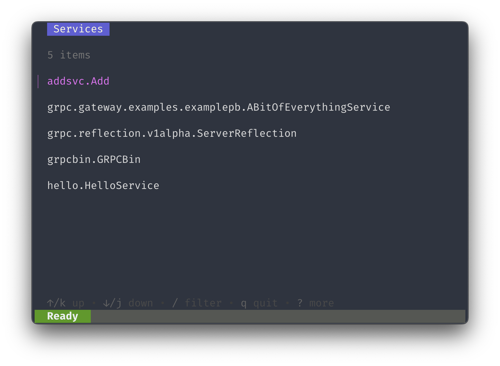
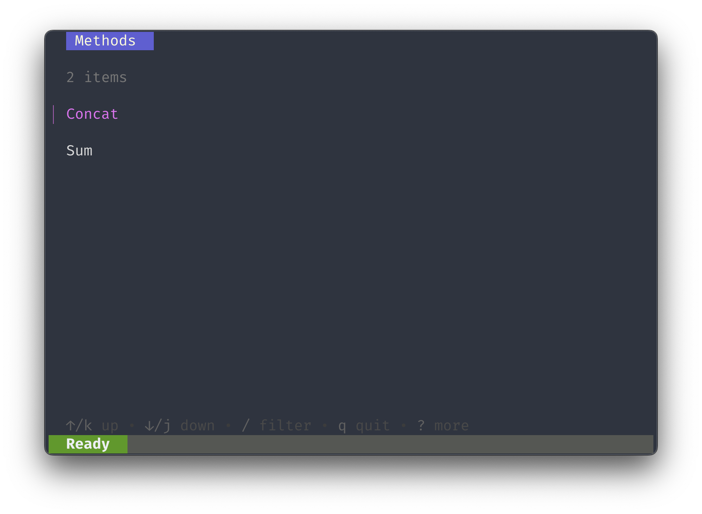
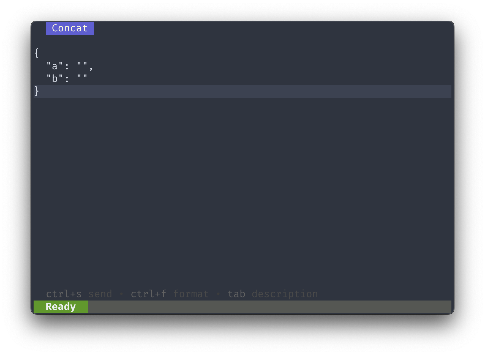
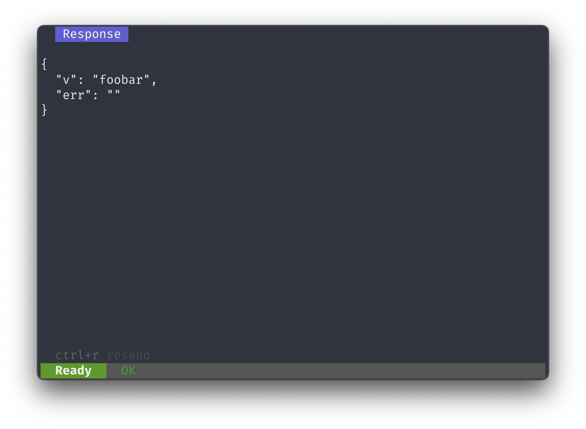

# jordi
`jordi` is gRPC terminal client.

The idea is to have an easy to use gRPC client with a simple UI that can be used in the terminal.

It's based on [gprcurl](https://github.com/fullstorydev/grpcurl) and currently only supports unary calls and [reflection](https://grpc.github.io/grpc/core/md_doc_server_reflection_tutorial.html).

# Installation
## GitHub Releases
Please see the [releases](https://github.com/rnesytov/jordi/releases).

Binaries are available for Linux and macOS.

## Homebrew (macOS)
```bash
brew tap rnesytov/jordi
brew install jordi
```

# Usage

```bash
jordi grpcb.in:9001
```
Use `Ctrl+C` to exit.

By default, `jordi` tries to connect to the given address using TLS. If you want to connect with an insecure connection, use the `-insecure` flag:
```bash
jordi -insecure grpcb.in:9000
```


You can navigate through the services using the arrow keys and press `Enter` to select a service and view the methods.



You can navigate through the methods using the arrow keys and press `Enter` to select a method and display its request editor.



In the request editor you can the edit the request JSON.
By default, `jordi` prepares a JSON request with default values for all fields. You can edit and send it.

To send the request, press `Ctrl+S`.

Press `Tab` to view the request message schema.

You can view the response JSON in the response viewer.



To return to the previous screen, use the `Esc` key.

You can also run `jordi` with a specific method:
```bash
jordi grpcb.in:9001 addsvc.Add.Concat
```
It will display the request editor for the given method.

# Features:
- [x] Loading and connection
- [x] Services list
- [x] Methods list
- [x] Request editor
- [x] Response viewer
- [x] Request example
- [x] Messages description
- [x] Status bar
- [x] Secure/unsecure connection
- [x] Response status
- [x] Resend request in response view
- [x] Nice titles for request/response
- [x] Handle invalid JSON
- [x] Store/load last successful request
- [ ] Response headers
- [ ] Handle long requests
- [ ] Request headers
- [ ] Proto file definitions
- [ ] Support most of grpcurl flags
